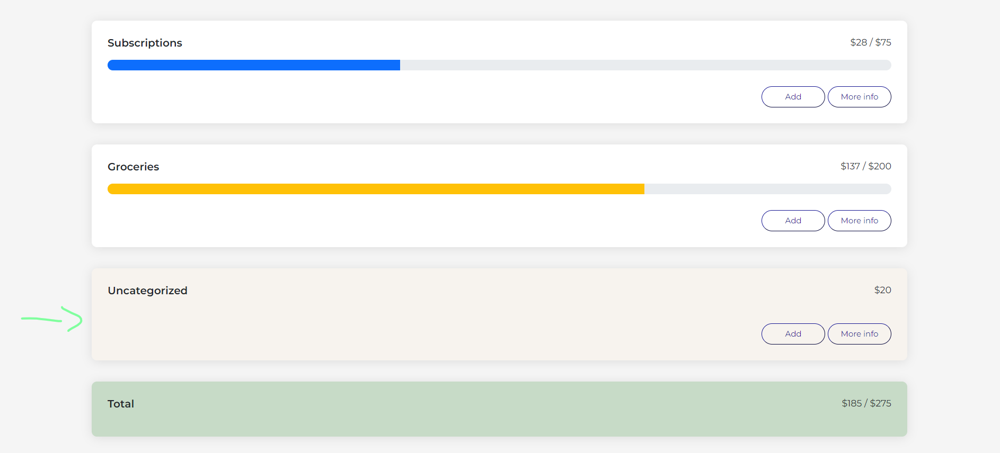

# Walt Jr - Budgeting & Banking

Walt Jr. is a budgeting application that allows users to manage their expenses.  This was a fun challenge! I dove deep into the world of React Hooks, integrating out of the box hooks and even creating some custom hooks. I also enjoyed adding my own styling (I included bootstrap for specific components such as the progress bar and modal, but the rest was done myself!). Since there is no authentication, another cool thing I added was storing all of the user information in local storage, that way the information persists even if the window is closed. Below, you can find a couple of the main features as well as instructions on how to deploy this application locally! This application was deployed on digitalocean :)

The landing page of Walt Jr comes with some pre-populated so the user can get an idea of the layout and how the application works. You might notice that the progress bar provides a visual representation of the percentage of expenses relative to the max budget. If the user goes over 50% the progress bar turns yellow, if the user goes over 75% it turns red!


If the user clicks on the hamburger on the top right of the application, a new header section appears that allows the user to add a budget (or an uncategorized expense). This happens with a cool animation too ;)


Once the user adds the budget, a new budget card will appear. If a user added an uncategorized expense, a new budget card called "Uncategorized" will appear and that expense will be included there




If the user clicks on the "add" button, a modal will appear where the user can add an expense to that budget. The drop down selection will automatically match that of the budget card they selected. Should they want to add this expense to a different budget, however, they could simply change the value in the dropdown menu


If the user clicks on the "more info" button, a modal will appear depicting all the expenses they have added to a certain budget. They then have the option of deleting the expenses from the budget. Users can also delete an entire budget, which would move all of the expenses within that budget to the uncategorized section


## Installation & Local Deployment

1) Create a clone of this repository
2) Cd into the correct directory, which should be the client folder

```bash
cd client
```

3) Run the command npm install

```bash
npm install
```

4) Run the command npm start

```bash
npm start
```

4) Congrats! You have successfully deployed this application locally

## Core Features

* **Adding a Budget Category**: A user can add a budget category which specifies the max amount that should in that category
* **Adding Expenses**: A user can add expenses into a budget category, or simply add it into uncategorized 
* **Removing a Budget Category**: If a user no longer wishes to keep track of a certain category, they can simply remove the category with the click of a button. This will reallocate all of the expenses stored in the deleted category to the uncategorized section
* **Removing Expenses**: Expenses that wish to be removed can be done so with one click
* **Total Expenses and Budgets Tracking**: A user will be able to view their total spending as well as their total budget allocation (sum of all budget categories)

## Tech Stack

* **ReactJS**
* **TypeScript**
* **Sass**

## Final Notes

* This was designed for a mobile app or tablet, responsive design was not incorporated. A mobile first approach design was taken.
